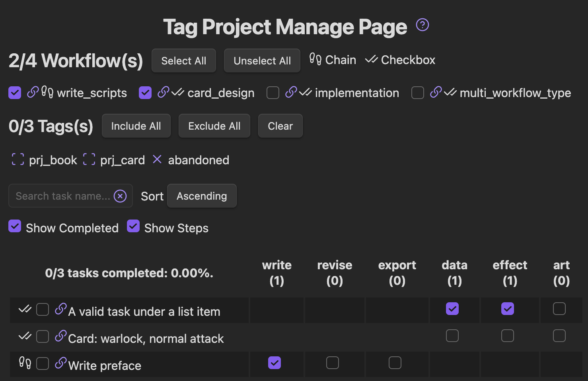
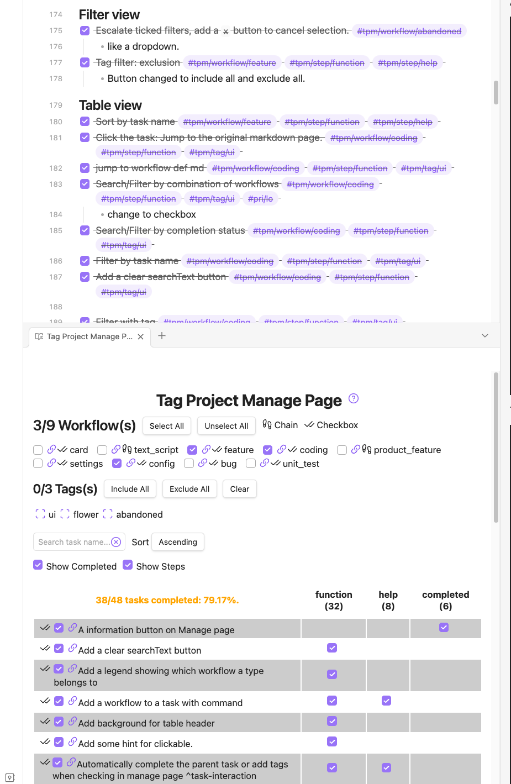

<h1 align="center">Tag Project</h1>

Tag tasks everywhere, Manage in One page

*Tag Project* extends [Dataview](https://github.com/blacksmithgu/obsidian-dataview), gives you freedom to manage
projects and track progress anywhere in your [Obsidian](https://obsidian.md/) vault.

*Tag Project* is developed with *Tag Project*!

<a href="http://htmlpreview.github.io/?https://github.com/Odaimoko/tag-project/blob/master/docs/tutorial-short.md">Tutorial (Short)</a> | <a href="http://htmlpreview.github.io/?https://github.com/Odaimoko/tag-project/blob/master/docs/tutorial-long.md">Tutorial (Long)</a> | <a href="/docs/user_manual.md">User Manual</a> | <a href="http://htmlpreview.github.io/?https://github.com/Odaimoko/tag-project/blob/master/docs/template.md">Template</a>

The tutorials and template are also available in the plugin's Help Page, directly accessible in Obsidian.

Github will not render these pages correctly. Please visit Help Page in Obsidian for readability.

## An example of Manage Page

## Installation

1. In Obsidian, open Settings > Community plugins > Browse.
1. Search for "Tag Project" by Odaimoko.
1. Select Install.

## In the Future

- Task linking to each other (jira)?
- Date and time track?
- Multiple workflows for one task?
- White list or black list of folders?
- [x] Better render in Manage Page table row

## Inspiration / Design Philosophy

When I was working on my indie game, I usually found that there are a whole lot of things to track:

- 20 monsters
- 12 chapters
- 21 game features
- ...

For every monster, I need to design it's

- skills
- action patterns
- art
- ...

For every newly added feature, I need to work on its

- implementation
- playtest
- unit test

Yep, gamedev is this pipelined.
And I write them everywhere in my vault. My ideas float a lot.

No Obsidian plugin solves the combination of the following problems

- Tasks are spread across the vault
- But I want to manage them in a single page
- Each task belongs to certain pre-defined workflow
- There are plenty of tasks with the same workflow
- Workflows and tasks should be easily defined and assigned

Fine, I'll do it myself.

Here's a screenshot of the tasks I created with *Tag Project* when developing it.

# License

[MIT](LICENSE)

# Contact/Sponsor

